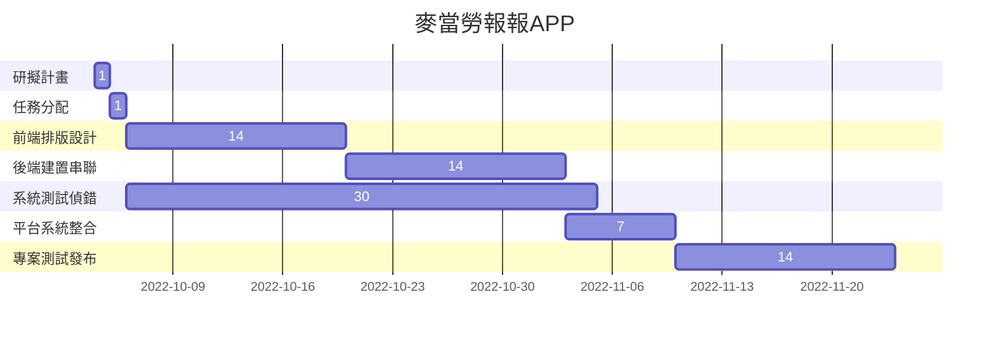
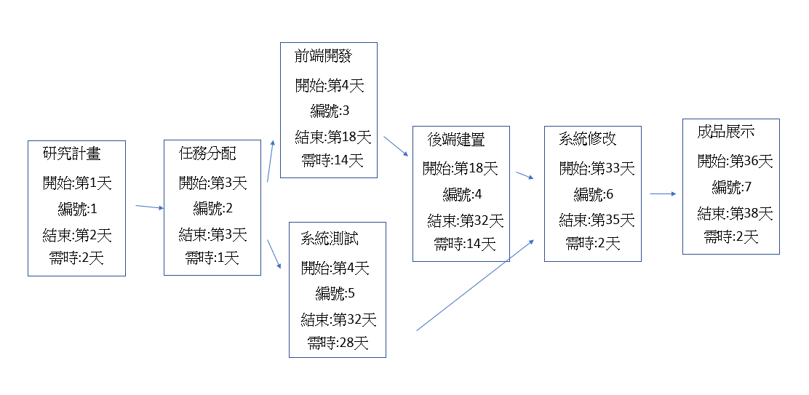

# Group05
---
### 組員名單：
|職位|學號|名字|
|:--:|:--:|:--:|
|*組長*|C109118248|[徐偉軒](https://github.com/noman248)|
|組員|C109118252|[林君熹](https://github.com/clemon2)|
|組員|C109118228|[王聖佑](https://github.com/C109118228)|
|組員|C109151217|[吳宗諺](https://github.com/C109118217)|
|組員|C109151218|[黃楙方](https://github.com/C109118218)|

---
###  組員任務
|名字|任務|
|:--:|:--:|
|林君熹| 前置準備，工作分配，底層邏輯，邏輯優化，Bug修復，圖表製作，使用者測試|
|王聖佑| 前置準備，初步製作， UI製作及場景切換 ，UI優化，使用者測試|
|吳宗彥| 前置準備，豐富游戲内容，邏輯優化，UI優化，使用者測試|
|黃楙方| 前置準備，底層邏輯，豐富游戲内容，PPT製作，GITHUB製作，使用者測試|

---
# 專題介紹
### 專題名稱： *麥當勞報報APP*
### 目的：
做一個更好的麥當勞報報
### 内容：
每日抽獎獎勵優化

## 麥當勞報報APP

## 麥當勞報報APPPERT圖

