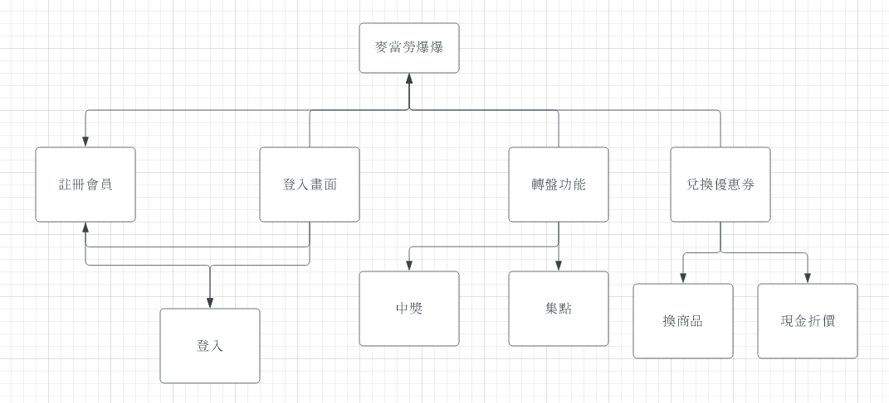
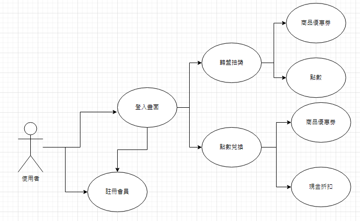
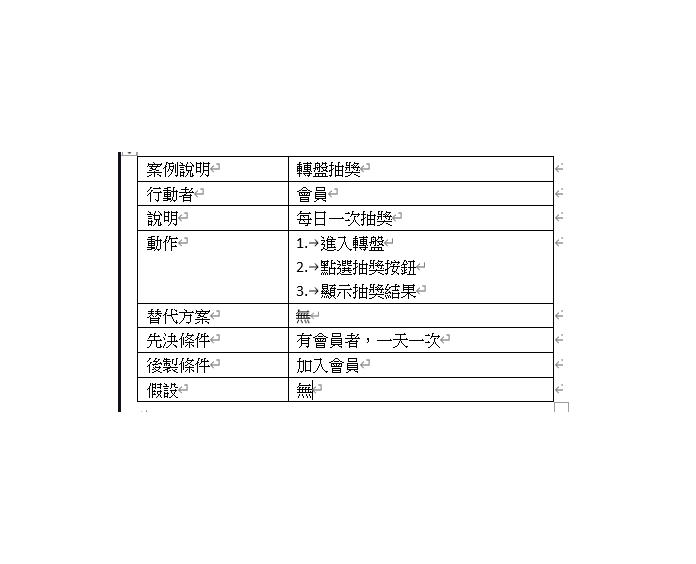
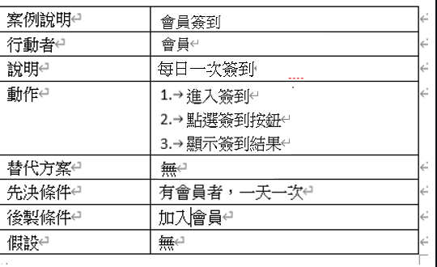

# 功能性需求及非功能性需求
功能性需求：

* 註冊會員
* 登入介面
* 轉盤功能
* 兌換優惠券 

非功能性需求：

* 使用性 : 使用者方便操作
* 反應時間 : 所有功能反應1秒內完成
* 維護性 : 定期維護及更新軟體

# DFD

# 需求分析
1. 使用者可在登入畫面選擇註冊帳號
2. 使用者在程式首頁登入帳號，進入主畫面
3. 每日有轉盤功能，可以抽出優惠券及點數
4. 集滿點數可以兌換不同優惠券
5. 點數也可以10:1現金折價

# 使用案例

使用案例1說明

使用案例2說明

使用案例3說明

# Figma
